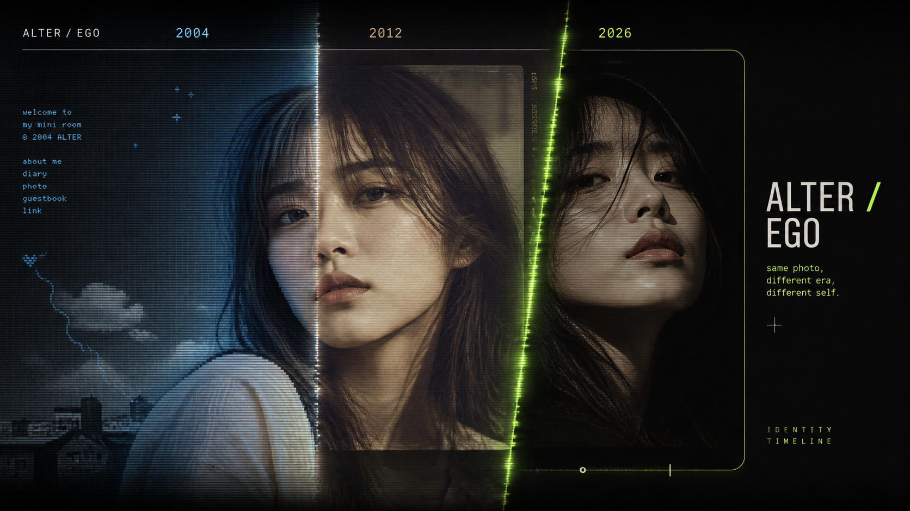

# ALTER / EGO — Time-Travel Identity Studio

같은 사진을 2004·2012·2026의 인터넷 문법으로 다시 기록하는 인터랙티브 카드 스튜디오입니다.
시간 경계를 직접 움직여 세 시대의 다른 정체성을 탐색하고, 선택한 장면을 나만의 카드로
완성할 수 있습니다. 모든 처리는 브라우저 안에서만 이루어지며 이미지는 서버로 전송되지 않습니다.

**[Live Demo](https://myeongjundev.github.io/t03-card-studio/)**



## Signature Experience

- **Temporal Scanner** — 사진 위의 경계선을 드래그해 두 시대를 한 프레임에서 비교합니다.
- **Three Eras** — 2004 미니홈피, 2012 소셜 피드, 2026 실시간 숏폼의 시각 문법을 재현합니다.
- **Three Identities** — 기본, 소셜, 친한 친구에게 보이는 나를 서로 다른 레이아웃으로 설계합니다.
- **Local-first Canvas** — 업로드 이미지, 편집 상태, PNG 생성이 브라우저 밖으로 나가지 않습니다.
- **One rendering truth** — 화면 미리보기와 다운로드가 같은 Canvas를 사용해 픽셀 차이가 없습니다.

## 실행

```bash
npm install
npm run dev
```

Windows PowerShell에서 실행 정책 오류가 발생하면 `npm` 대신 `npm.cmd`를 사용합니다.

```powershell
npm.cmd install
npm.cmd run dev
```

빌드는 `npm run build`, 결과 확인은 `npm run preview` 입니다.

## 검사

```bash
npm test                              # 단위 테스트 (브라우저 불필요)
npm run build && npm run test:e2e     # 실제 브라우저에서 픽셀 검사
```

e2e 를 처음 돌릴 때는 `npx playwright install chromium` 이 한 번 필요합니다.
둘 다 배포 워크플로에서 자동으로 실행되며, 실패하면 배포되지 않습니다.

**단위 테스트는 "무엇을 그리라고 시켰는가"** 를 그리기 호출 기록으로 고정하고,
**e2e 는 "실제로 어떤 픽셀이 나왔는가"** 를 봅니다. 역할이 다릅니다 — 예를 들어
컴포넌트가 캔버스에 직접 덧그리는 결함은 렌더러가 멀쩡하므로 e2e 에서만 걸립니다.

## 기능

- **시대를 직접 가르는 첫 화면** — 포인터·터치·방향키로 2004·2012·2026을 탐색하고 Studio에 연결
- **작품으로 보기** — 편집 UI를 숨기고 결과를 독립된 전시 화면으로 확인
- **모바일 빠른 시작** — 시대 선택 후 결과 미리보기로 바로 이동하고 편집 중 플로팅 미리보기 지원
- 이미지 불러오기 (PNG · JPEG), `가득 채우기` / `전체 보이기`
- 문구 입력과 위치 · 크기 · 색상 · 줄 간격 · 정렬 조절, 즉시 미리보기 반영
- 1:1 (1080×1080) · 4:5 (1080×1350) · 9:16 (1080×1920)
- PNG 내려받기 — 미리보기 캔버스를 그대로 파일로 만듭니다
- 템플릿 생성 · 불러오기 · 수정 · 삭제, 새로고침 후에도 유지
- 템플릿 JSON 내보내기 / 가져오기, 잘못된 파일은 기존 데이터를 건드리지 않고 거부
- **링크 하나로 카드 공유** — 서버 없이 주소에 설정을 담아 그대로 열립니다
- **가독성 검사** — 문구 아래 픽셀을 실제로 읽어 대비를 재고, 안 읽히면 색을 제안합니다
- **문구를 끌어서 이동** — 미리보기에서 직접 끌어 옮깁니다. 슬라이더도 그대로 씁니다
- **자막 외곽선** — 검은 테두리로 어떤 사진 위에서도 글자가 읽힙니다
- **온라인에서 보여줄 모습** — 기본 · 소셜 · 친한 친구 중 지금의 나를 골라 표현합니다.
  화면 비율은 건드리지 않고, 어울리는 비율은 추천 배지로만 알려 줍니다
- **시대 타임라인** — 사진의 화질까지 시대를 따라갑니다.
  2004 는 싸이월드 미니홈피에 올린 **그 시절 사진**(뭉개진 저해상도·날아간 하이라이트·보라 기울기),
  2012 는 **필름 인화 사진**(입자·색바램·비네팅), 2026 은 원본 그대로입니다
- **이미지 복사** — 클립보드에 넣어 대화창에 바로 붙여넣습니다
- **되돌리기 / 다시하기** — Ctrl+Z · Ctrl+Shift+Z, 타이핑처럼 이어진 변경은 한 단계로 묶입니다
- **게시 전 확인** — 실제 렌더 결과의 대비·크기·자동 축소·내보내기 상태를 게시 전에 확인합니다
- **9:16 Safe Area** — 세로형 플랫폼 UI와 겹칠 수 있는 일반 영역을 PNG와 분리된 가이드로 확인합니다
- **내 브라우저에서만** — 고른 이미지는 서버로 보내지 않고 현재 브라우저 안에서만 처리합니다

## 설계에서 중요한 두 가지

**미리보기와 다운로드가 같은 픽셀입니다.**
화면용과 저장용 렌더러를 따로 두면 반드시 어긋나므로, 미리보기 캔버스의 내부 해상도를
출력 해상도와 같게 잡고 화면에는 CSS 로만 축소해 보여줍니다. 다운로드는 그 캔버스를
그대로 `toBlob()` 합니다. 다시 그리지 않습니다.

**JSON 가져오기는 검증이 끝난 뒤에만 저장합니다.**
`파일 읽기 → 파싱 → 구조 → 필수 항목 → 타입 → 값 범위 → 전부 통과 → 저장` 순서이며,
검증 함수(`src/templates/schema.js`)는 저장소에 접근조차 하지 않는 순수 함수입니다.

## 성능

- Scanner와 Identity Archive의 원본 PNG는 보존합니다.
- 실제 앱은 AVIF 파생본을 사용해 두 사진의 전송 크기를 약 **5.1MB → 175KB**로 줄였습니다.
- 2004 이미지 보정은 이미지와 변형 조건별로 캐시해 문구 편집 때 같은 필터를 반복하지 않습니다.

## 문서

- [검증 안내서](docs/VERIFICATION.md) — 30초 확인 절차
- [구현 설계](docs/ARCHITECTURE.md) — 데이터 흐름과 렌더링 구조
- [포트폴리오 사례 요약](docs/PORTFOLIO-CASE-STUDY.md) — 문제, 판단, 결과, 면접 설명
- [작업 인수인계](work-log/HANDOFF-2026-08-25.md) — 로컬 실행과 다음 작업 우선순위
- [극단 입력 검사표](docs/TEST-EDGE-CASES.md) — 12개 검사 결과와 대표 결함 수정 기록
- [자체 점검 자료](docs/SELF-CHECK.md) — 배포본에서 측정한 전체 검증 기록

## 폴더

```text
src/
  state/      편집 상태 모델과 값 범위
  render/     렌더러 (renderCard / wrapText / fitImage)
  templates/  검증(schema)과 localStorage(storage)
  io/         이미지 내보내기, 템플릿 JSON 입출력
  components/ Temporal Scanner · 편집 · 미리보기 · 템플릿 패널
scripts/      검사용 이미지 생성, 렌더 스냅샷 갱신, 브라우저 측정 스크립트
test/         단위 테스트와 렌더 회귀 스냅샷(fixtures/)
docs/         설계 · 검사표 · 검증 안내서 · 완성 이미지
```

## AI 사용 기록

- **AI에게 맡긴 일** — 컴포넌트 분리, Canvas 렌더 함수와 줄바꿈 로직 구현,
  localStorage CRUD 와 JSON 스키마 검증 코드 작성, 극단 입력 측정 스크립트 작성.
- **내가 판단한 일** — 미리보기와 다운로드를 같은 캔버스로 통일하는 구조 결정,
  템플릿에 이미지를 저장하지 않기로 한 판단과 그 사실을 화면에 밝히기로 한 결정,
  자동 축소를 조용히 하지 않고 사용자에게 알리기로 한 결정, 화면 3분할 구성.
- **AI 말을 안 들은 일** — 렌더를 `requestAnimationFrame` 으로 모으자는 처음 구성을 되돌렸습니다.
  탭이 보이지 않으면 rAF 가 호출되지 않아 빈 이미지가 저장될 수 있어서, 동기 렌더로 바꿨습니다.
  또 극단 입력 검사에서 "이상 없음" 으로 넘어갈 뻔한 항목을 조건을 더 밀어붙여 다시 검사해
  세로 넘침 결함을 찾아냈습니다.
